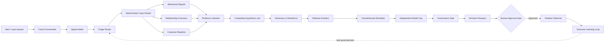

# Fraud Defense Autonomy Engine

### 🎥 Fraud Defense Project Demo

<p align="center">
  <video src="./Neuro_SAN-2377778.mp4" controls autoplay muted loop playsinline width="960" poster="./docs/images/overview.png" style="max-width:100%; border-radius:12px;">
    Your browser does not support the video tag.
  </video>
</p>

Fraud War Room is the submission application for the Cognizant NA BFS hackathon. It demonstrates a governed, multi-agent Fraud Defense Autonomy Engine for synthetic banking data. The system moves from alert to investigation, adversarial challenge, defense simulation, policy review, human approval, shadow observation, and outcome learning while keeping deterministic facts traceable and high-risk actions under human control.

The design principle is simple: an alert score is a starting point, not a decision. Every recommendation must show its evidence, counter-evidence, competing explanations, attack test, customer-impact trade-off, model disagreement, governance result, approval state, and Decision Passport.

## Submission assets

- Live dashboard: <http://127.0.0.1:8090>
- Interactive six-slide deck: <http://127.0.0.1:8090/static/presentation.html>
- Downloadable PowerPoint: <http://127.0.0.1:8090/static/Fraud_Defense_Autonomy_Engine_Submission.pptx>
- Neuro SAN / NSFlow UI: <http://127.0.0.1:4175> when started with the demo port override, or <http://127.0.0.1:4173> with the default runner settings
- Canonical network: `industry/fraud_defense`
- Flagship synthetic case: `CASE-0001`

The browser deck supports arrow keys, space, swipe gestures, fullscreen presentation, and print-to-PDF. The PowerPoint file contains the same six-slide narrative for submission and offline presenting.

## The problem

Financial fraud operations have three related gaps:

1. **Scores lack context.** A risk score does not reconstruct the transaction sequence, customer baseline, connected entities, or legitimate explanations an investigator must review.
2. **Controls are rarely challenged before rollout.** A proposed hold, step-up, or review control can fail against the next attacker variation or impose unnecessary friction on legitimate customers.
3. **Decisions are difficult to defend later.** Evidence, model opinions, policy checks, approvals, and observed outcomes are often scattered across tools instead of being captured as one traceable record.

Fraud War Room turns these gaps into one bounded operating loop. It is designed for a clear demo with synthetic data, while preserving the control points expected in an enterprise fraud workflow.

## The solution

The engine combines four capabilities:

- **Deterministic evidence first.** Python coded tools calculate signals, baselines, graph findings, timelines, risk, governance checks, simulations, and learning records. The LLM layer explains and challenges these facts; it does not calculate hidden labels or invent transaction data.
- **Independent reasoning lanes.** Behavioral, relationship, and customer-baseline analysts inspect the same case packet independently before an Evidence Librarian reconciles their findings.
- **Adversarial defense design.** A Competing Hypothesis Lab preserves benign and fraud explanations. An Adversary-in-Residence creates a bounded synthetic bypass challenge, and a Counterfactual Simulator compares candidate controls before approval.
- **Governed lifecycle.** An Independent Model Jury exposes disagreement, the Governance Gate checks policy, the Decision Passport records the decision, and a human investigator must approve high-risk recommendations before a control can enter `SHADOW`. Shadow observation and outcome learning never activate a production rule directly.

## Architecture at a glance



The registry makes this topology visible in Neuro SAN. The network contains 18 named nodes and 17 directed handoffs. `Fraud Commander` is the conversational front door; `run_case_review` is the deterministic coded tool inside the triage path; all other stages have one bounded responsibility and an explicit handoff.

## Node catalog

| # | Registry node | Display name | Responsibility and guardrail |
| ---: | --- | --- | --- |
| 1 | `fraud_commander` | Fraud Commander | Extracts the synthetic case ID, coordinates the full investigation, and returns the investigator-facing brief. It never approves, rejects, deploys, or records an outcome from chat. |
| 2 | `case_intake` | Signal Intake | Normalizes the request, confirms the case scope, and passes the original request and case ID to triage. It does not infer missing facts or make a risk decision. |
| 3 | `triage_router` | Triage Router | Calls the deterministic review once, fans the same packet into three independent analyst lanes, preserves disagreements, and invokes evidence synthesis after the lanes complete. |
| 4 | `run_case_review` | Deterministic Case Packet | A coded tool that creates the source-of-truth packet: signals, timeline, graph findings, hypotheses, controls, governance checks, simulation inputs, routing context, and passport data. |
| 5 | `behavioral_signals` | Behavioral Signal Lab | Examines transaction sequence, amount anomalies, device novelty, location novelty, and beneficiary behavior. It separates observed facts from interpretation and names disconfirming evidence. |
| 6 | `relationship_forensics` | Relationship Graph Forensics | Investigates connected accounts, devices, beneficiaries, components, central entities, and campaign structure. Connectivity is treated as a signal, not proof. |
| 7 | `customer_baseline` | Customer Baseline | Compares the case with customer and account history, identifies normal behavior and deviations, and records plausible authorized explanations and customer-impact risks. |
| 8 | `evidence_synthesizer` | Evidence Librarian | Builds a balanced evidence ledger with supporting evidence, counter-evidence, missing evidence, traceability, and confidence limits. |
| 9 | `hypothesis_lab` | Competing Hypothesis Lab | Generates and ranks multiple explanations, including authorized, accidental, and coordinated-fraud hypotheses when evidence supports them. |
| 10 | `adversary_in_residence` | Adversary in Residence | Stress-tests the leading hypothesis and investigation logic with one bounded synthetic bypass scenario. It reports what signal changes and whether the current evidence detects it; it does not provide criminal instructions. |
| 11 | `defense_architect` | Defense Architect | Designs proportional prevention, step-up, hold, and review controls. Each option includes friction, reversibility, and safe operating conditions. |
| 12 | `counterfactual_simulator` | Counterfactual Simulator | Compares candidate controls against synthetic variants using fraud prevented, attack success, false-positive rate, customer friction, and utility. It explains the selected control and uncertainty. |
| 13 | `model_jury` | Independent Model Jury | Reviews the evidence, hypotheses, attack challenge, and simulation using independent model opinions or labelled local heuristic opinions. Disagreement is exposed, never silently averaged away. |
| 14 | `governance_gate` | Governance Gate | Checks evidence sufficiency, counter-evidence, model disagreement, simulation coverage, proportionality, human approval, and the rule that approved controls enter `SHADOW` only. |
| 15 | `decision_passport` | Decision Passport | Creates the auditable decision record with case ID, reason codes, evidence, hypotheses, adversarial outcome, selected simulation, jury record, failed checks, approval requirement, lifecycle, and audit events. |
| 16 | `human_approval_gate` | Human Approval Gate | Presents the recommendation, failed checks, customer-impact trade-off, and passport reference. High and critical cases remain pending until an explicit investigator action in the War Room UI. |
| 17 | `shadow_observer` | Shadow Observer | Runs only after approval has been recorded. It introduces a bounded synthetic attacker variation, reports containment or bypass, and keeps the control in `SHADOW`; it never activates production enforcement. |
| 18 | `outcome_learner` | Outcome Learning Loop | Compares predicted simulation results with the shadow observation, identifies drift or a new bypass, and proposes the next governed test. It never changes a production rule directly. |

## End-to-end flow

1. An investigator opens a synthetic case such as `CASE-0001` or asks the network to investigate it.
2. Fraud Commander and Signal Intake validate the request and case scope.
3. Triage Router calls `run_case_review` once. This produces deterministic facts and keeps hidden benchmark labels outside the agent context.
4. The packet is reviewed independently by Behavioral Signal Lab, Relationship Graph Forensics, and Customer Baseline.
5. Evidence Librarian reconciles the three memos and records supporting, counter, and missing evidence.
6. Competing Hypothesis Lab keeps multiple explanations alive instead of forcing an early binary conclusion.
7. Adversary in Residence challenges the leading hypothesis and the assumptions behind the proposed defense.
8. Defense Architect proposes proportional controls, and Counterfactual Simulator evaluates them against synthetic attack variants and false-positive costs.
9. Independent Model Jury records provider names, confidence spread, and disagreement. High-risk disagreement can require more evidence.
10. Governance Gate applies policy checks. Decision Passport records the result, including any failed check and required human action.
11. Human Approval Gate stops high and critical actions until an investigator explicitly approves, rejects, or requests more investigation in the dashboard.
12. An approved control enters `SHADOW`. Shadow Observer tests a new bounded attacker variation, and Outcome Learning records predicted-versus-observed behavior for the next governed review.

The natural-language commander explains this handoff in plain language. Structured data remains in the coded workbench and Decision Passport so an operator can inspect the source of every important statement.

## Technology and model routing

| Layer | Implementation | Why it is used |
| --- | --- | --- |
| Agent orchestration | Neuro SAN with HOCON registry configuration | Makes the 18-node topology, instructions, tools, and handoffs explicit and inspectable. |
| Network definition | `registries/industry/fraud_defense.hocon` | Single canonical `industry/fraud_defense` network with bounded steps and execution time. |
| Deterministic domain core | Python standard-library package under `coded_tools/fraud_defense/` | Keeps facts, scoring, graph traversal, simulation, governance, and persistence reproducible and key-free. |
| Investigator surface | `apps/fraud_war_room/` standard-library HTTP server plus static HTML/CSS/JS | Provides the live case queue, graph, timeline, evidence, controls, approval, shadow lifecycle, learning, and passport views. |
| Primary LLM | Cerebras API, Qwen 3.8 27B | Used by the native Neuro SAN network when `CEREBRAS_API_KEY` is configured. The default endpoint is `https://api.cerebras.ai/v1`. |
| Fallback LLMs | Gemini and NVIDIA, configured in HOCON | Keep the network operational when the primary provider is unavailable, subject to the same governance controls. |
| Optional provider roles | NVIDIA, Gemini, and Sarvam in `config/fraud_defense_models.json` | Allow risk-tiered worker routing, independent opinions, and optional voice or language extensions without changing the graph. |
| Audit artifact | Decision Passport JSON | Keeps evidence, reasoning summaries, policy checks, approvals, lifecycle state, and audit events together without storing chain-of-thought. |
| Evaluation | Seeded synthetic benchmark | Compares deterministic baseline, agentic investigation, and adversarial defense modes against hidden generated labels. |

The model router runs deterministic analysis first for every risk tier. Low-risk cases can use a local summary; medium-risk cases use one configured worker with fallback; high and critical cases can request independent opinions and an adversarial loop. `FRAUD_MODEL_DISAGREEMENT_THRESHOLD` defaults to `0.18`, and `FRAUD_PROVIDER_TIMEOUT_SECONDS` defaults to `8`.

When no provider key is configured, the dashboard and deterministic coded tools still run. High and critical offline investigations use explicitly labelled local heuristic opinions for reproducible disagreement testing. These local opinions are not represented as external model calls.

## Setup

### Prerequisites

- Python 3.12 or newer
- Git
- A working Neuro SAN Studio checkout
- Optional: a Cerebras API key for live Qwen 3.8 27B network conversations

### Windows PowerShell

From the repository root:

```powershell
py -3.12 -m venv .venv
.\.venv\Scripts\Activate.ps1
python -m pip install --upgrade pip
python -m pip install -e .
Copy-Item .env.example .env
```

If PowerShell blocks activation, use the Python executable directly with `.venv\Scripts\python.exe` or allow scripts for the current user with `Set-ExecutionPolicy -Scope CurrentUser RemoteSigned`.

### macOS or Linux

```bash
python3.12 -m venv .venv
source .venv/bin/activate
python -m pip install --upgrade pip
python -m pip install -e .
cp .env.example .env
```

### Configure Cerebras Qwen 3.8 27B

Edit `.env` and set the key without committing the file:

```dotenv
CEREBRAS_API_KEY=your-cerebras-key
FRAUD_CEREBRAS_MODEL=qwen-3.8-27b
FRAUD_CEREBRAS_BASE_URL=https://api.cerebras.ai/v1
```

The native network reads its provider fallback order from `config/fraud_defense_llm_config.hocon`, where Cerebras Qwen 3.8 27B is primary and Gemini/NVIDIA are fallbacks when configured. The application router reads role settings from `config/fraud_defense_models.json`. Never place a real key in HOCON, JSON, source code, or a commit.

## Run the demo

Start the deterministic dashboard from the repository root:

```bash
python -m apps.fraud_war_room --port 8090
```

Open <http://127.0.0.1:8090>. This dashboard uses seeded synthetic data and does not require a provider key.

In a second terminal, start the Neuro SAN server and NSFlow:

```bash
ns run
```

The default server is `http://127.0.0.1:8080` and the default NSFlow UI is <http://127.0.0.1:4173>. If those ports are occupied, use an explicit pair:

```bash
ns run --server-http-port 8081 --nsflow-port 4175
```

Open the UI, select `industry/fraud_defense`, and ask:

```text
Investigate CASE-0001 and show the full evidence trail.
```

The dashboard and the Neuro SAN network are complementary: the network explains the investigation, while the dashboard is the controlled action surface for approval, rejection, more investigation, shadow advancement, and passport inspection.

## Recommended judging flow

1. Open the dashboard and select `CASE-0001`, the coordinated payment-fraud campaign.
2. Show the 18-node network and explain the three independent analyst lanes.
3. Open the timeline, evidence ledger, relationship graph, competing hypotheses, and model jury.
4. Compare the candidate controls and show the counterfactual simulation trade-offs.
5. Point out the governance checks and Decision Passport before taking action.
6. Approve the recommendation from the dashboard. The lifecycle becomes `SHADOW`, never production.
7. Introduce the next synthetic attacker variation. Show whether a bypass is detected and whether a revised control is proposed.
8. Finish on the predicted-versus-observed learning record and the audit passport.

The key innovation is that the attacker is part of the design loop. The system does not stop at detection or recommendation; it challenges the proposed defense, tests it against counterfactuals, requires governed approval, observes it safely, and feeds the result into the next review.

## Local HTTP API

The dashboard server is loopback-only and exposes read-only case inspection plus explicit investigator actions:

| Method | Endpoint | Purpose |
| --- | --- | --- |
| GET | `/api/health` | Runtime and execution-mode health. |
| GET | `/api/network` | The 18-node / 17-edge dashboard topology. |
| GET | `/api/cases` | Synthetic investigator queue. |
| GET | `/api/bootstrap` | Topology, cases, and the flagship investigation in one response. |
| GET | `/api/cases/{case_id}` | Full deterministic investigation and Decision Passport. |
| POST | `/api/cases/{case_id}/approve` | Record an explicit boolean human decision. Approved controls enter `SHADOW`. |
| POST | `/api/cases/{case_id}/reject` | Reject the recommendation. |
| POST | `/api/cases/{case_id}/more-investigation` | Request more evidence without changing lifecycle. |
| POST | `/api/cases/{case_id}/shadow-advance` | Run the next bounded shadow variation after approval. |
| POST | `/api/benchmark` | Run the reproducible synthetic benchmark and write its artifact. |

POST requests enforce same-origin browser semantics, explicit approval booleans, bounded request bodies, and the human approval lifecycle. The server refuses non-loopback binding because it is a local demo command center, not an internet-facing gateway.

## Evaluation and verification

Run the focused regression suite:

```bash
python -m pytest tests/fraud_defense -q
```

For optional live provider validation, run this command after activating the virtual environment. It performs outbound model calls, so it requires configured provider credentials and network access. The key-free deterministic demo does not need this check:

```bash
ns check-config --hocon-path config/fraud_defense_llm_config.hocon
```

Run the reproducible benchmark:

```bash
python -c "from coded_tools.fraud_defense.benchmark import run_benchmark; import json; print(json.dumps(run_benchmark(output_path='artifacts/fraud_benchmark.json'), indent=2))"
```

The benchmark defaults to 600 synthetic cases and compares deterministic baseline, agentic investigation, and full adversarial defense modes. Results are reproducible for a fixed seed and are not production performance claims.

## Enterprise controls and production boundary

The prototype is submission-ready and production-shaped, but it intentionally runs on synthetic data and a local standard-library server. The following controls are implemented in the demo:

- No Cognizant, client, bank, or customer data is shipped.
- Hidden ground truth remains in the benchmark/workbench layer and is not sent to agents.
- Deterministic facts are separated from model-generated explanations.
- Provider failures, timeouts, malformed responses, and disagreement have deterministic fallbacks and explicit status.
- High and critical recommendations require an explicit human action.
- Approved controls can enter `SHADOW` only; there is no production execution path.
- Decision Passports capture audit-relevant summaries without storing chain-of-thought.
- The local server binds to loopback and constrains static paths and request bodies.
- API keys are environment-only and the repository contains placeholders, not secrets.

A production deployment should place the command center behind an authenticated API gateway and TLS, use a managed secret store, durable encrypted case and passport storage, RBAC with separation of duties, a durable queue for long-running work, structured logs/traces/metrics, retention and deletion policies, provider egress controls, rate limits, CI/CD approvals, and an independent model/risk validation process. Those deployment services are intentionally outside this offline hackathon demo.

## Repository map

```text
apps/fraud_war_room/                    Local investigator dashboard and demo server
apps/fraud_war_room/static/             HTML/CSS/JS deck and downloadable PowerPoint
coded_tools/fraud_defense/              Synthetic domain, analytics, routing, simulation, and coded tools
config/fraud_defense_llm_config.hocon   Native Neuro SAN provider fallback configuration
config/fraud_defense_models.json        Application provider roles and thresholds
registries/industry/fraud_defense.hocon  18-node canonical Neuro SAN network
docs/fraud-defense-architecture.md      Architecture decisions and boundaries
docs/model-routing.md                   Provider routing and fallback behavior
tests/fraud_defense/                    Unit, HOCON, failure-mode, and deterministic E2E coverage
artifacts/                               Local benchmark and demo artifacts
```

## Safety boundary

This project is a controlled synthetic demonstration. It does not connect to a bank, block a payment, contact a customer, deploy a production control, or make a final fraud decision without an authorized human investigator. Any future production integration must preserve the evidence trail, approval gate, shadow lifecycle, access controls, monitoring, and validation requirements described above.
